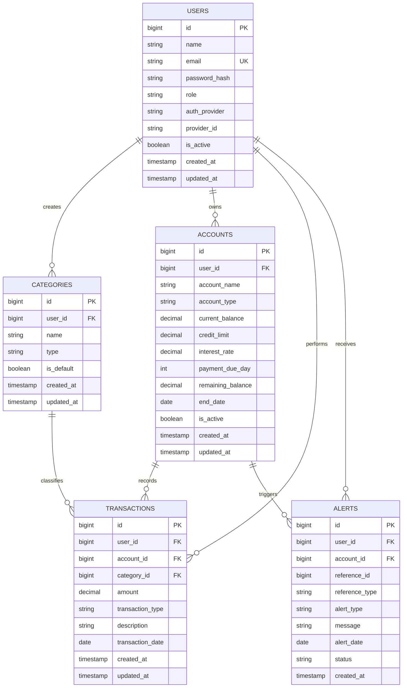

# Finstable

**Finstable** is a personal finance management platform built to help users track spending, manage multiple financial accounts, and stay organized with recurring financial obligations.

Many expense trackers stop at basic transaction logging and simple analytics. Finstable goes beyond that by helping users manage different sources of money, monitor recurring expenses, track debt-related payments, and maintain better financial discipline from one centralized platform.

This platform is built for:

- Students managing limited monthly budgets
- Young professionals tracking salary and expenses
- Individuals managing multiple bank accounts or credit cards
- Users handling recurring expenses such as rent, subscriptions, and EMIs
- Anyone who wants better visibility into their financial habits

---

## Features

Users will be able to:

- Create an account and securely log in
- Track income and expenses
- Categorize spending (food, travel, shopping, bills, etc.)

### Manage Multiple Financial Accounts
Users can create and manage:

- Bank accounts
- Savings accounts
- Credit cards
- Recurring payment accounts

---

### Track Spending Behavior

- Track spending from specific accounts
- View spending history between custom date ranges
- Analyze monthly spending patterns

---

### Savings Management

- Set aside money into savings accounts
- Use savings funds for future expenses

---

### Credit Card Management

- Manage credit card spending
- Monitor unpaid balances
- Handle partial payments
- Track unpaid dues carried into future billing cycles

---

### Recurring Payment Management

Track recurring expenses such as:

- EMI payments
- Rent
- Subscriptions

Users can also:

- Receive reminders before payment deadlines
- Manage ongoing recurring obligations

---

### Export Features

- Export transaction history as CSV files

---

## Goal

Finstable aims to help users better understand their financial behavior, manage recurring obligations, track multiple financial accounts, and make smarter financial decisions from one platform.

