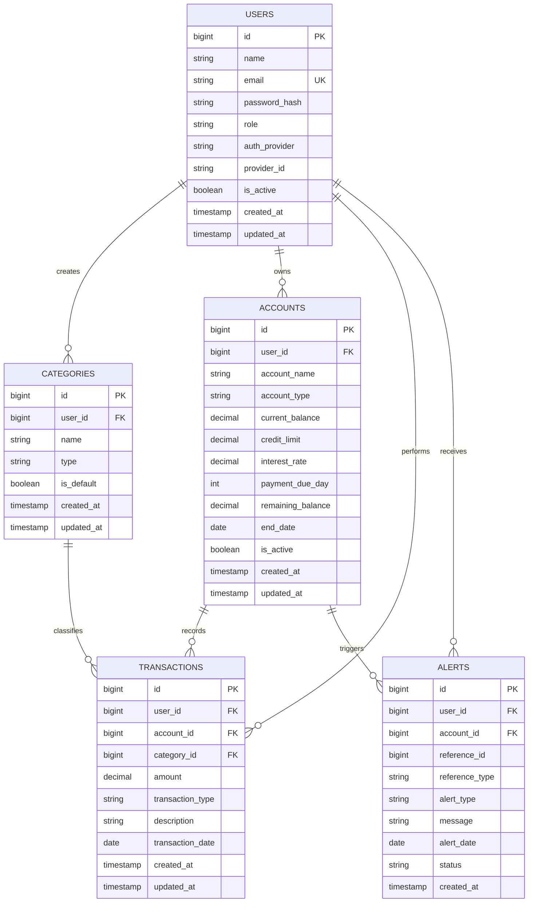

# Finstable

**Finstable** is a personal finance management platform built to give users clear visibility over how their money moves.

It brings savings, categorized expenses (food, rent, EMIs, etc.), and recurring financial commitments (EMIs, credit card payments, subscriptions) into one place, making it easier to stay organized and in control.

This platform is built for:

- Students managing limited monthly budgets
- Young professionals tracking salary and expenses
- Individuals managing multiple credit cards
- Users handling recurring expenses such as rent, subscriptions, and EMIs
- Anyone who wants better visibility into their financial habits

---

## Features

Users will be able to:

- Create an account and securely log in
- Track income and expenses
- Categorize spending (food, travel, shopping, bills, etc.)

### Manage Multiple Financial Accounts
Users can create and manage:

- Bank accounts
- Savings accounts
- Credit cards
- Recurring payment accounts

---

### Track Spending Behavior

- Track spending from specific accounts
- View spending history between custom date ranges
- Analyze monthly spending patterns

---

### Savings Management

- Set aside money into savings accounts
- Use savings funds for future expenses

---

### Credit Card Management

- Manage credit card spending
- Monitor unpaid balances
- Handle partial payments
- Track unpaid dues carried into future billing cycles

---

### Recurring Payment Management

Track recurring expenses such as:

- EMI payments
- Rent
- Subscriptions

Users can also:

- Receive reminders before payment deadlines
- Manage ongoing recurring obligations

---

### Export Features

- Export transaction history as CSV files

---

# ER Diagram

# DB Design 

## USERS

### Columns
- id
- name
- email
- password_hash
- role
- auth_provider
- provider_id
- is_active
- created_at
- updated_at

### Purpose
Handles authentication and ownership of financial data.

---

## CATEGORIES

### Columns
- id
- user_id
- name
- type
- is_default
- created_at
- updated_at

### Purpose
Organizes transactions into meaningful spending/income groups.

---

## ACCOUNTS

### Columns
- id
- user_id
- account_name
- account_type
- current_balance
- credit_limit
- interest_rate
- payment_due_day
- remaining_balance
- end_date
- is_active
- created_at
- updated_at

### Purpose
Represents multiple financial sources where money is stored or spent.

---

## TRANSACTIONS

### Columns
- id
- user_id
- account_id
- category_id
- amount
- transaction_type
- description
- transaction_date
- created_at
- updated_at

### Purpose
Acts as the financial ledger of the system.

---

## ALERTS

### Columns
- id
- user_id
- account_id
- reference_id
- reference_type
- alert_type
- message
- alert_date
- status
- created_at

### Purpose
Handles reminders and financial notifications.

---

# API Endpoints

[//]: # (## GET Endpoints)

[//]: # (- `GET /accounts`)

[//]: # (- `GET /transactions`)

[//]: # (- `GET /transactions/filter`)

[//]: # (- `GET /categories`)

[//]: # (- `GET /alerts`)

[//]: # (---)

[//]: # ()
## POST Endpoints
- `POST /auth/signup`
- `POST /auth/login`

[//]: # (- `POST /accounts`)

[//]: # (- `POST /transactions`)

[//]: # (- `POST /categories`)

---

[//]: # (## PUT Endpoints)

[//]: # (- `PUT /accounts/{id}`)

[//]: # (- `PUT /transactions/{id}`)

[//]: # (- `PUT /categories/{id}`)

[//]: # (---)

[//]: # (## DELETE Endpoints)

[//]: # (- `DELETE /accounts/{id}`)

[//]: # (- `DELETE /transactions/{id}`)

[//]: # (- `DELETE /categories/{id}`)

[//]: # (---)

[//]: # (# How To Use)

[//]: # (## Live Product)

[//]: # (Backend Deployment Link: **Coming Soon**)

[//]: # ()
[//]: # (Frontend Link: **Coming Soon**)

[//]: # (---)

[//]: # (## Documentation)

[//]: # (Detailed usage guide:)

[//]: # (Read the [Usage Guide]&#40;./readHowToUseMe.md&#41;)

[//]: # (---)

# Tech Stack

## Backend
- Java
- Spring Boot
- Spring Security
- JWT

[//]: # (- OAuth2)

---

## Database
- PostgreSQL
- Flyway

---

[//]: # (## Testing)

[//]: # (- JUnit *&#40;planned&#41;*)

[//]: # (- Mockito *&#40;planned&#41;*)

[//]: # ()
---

## Tools & DevOps
- Git
- GitHub
- Postman

[//]: # (- Docker *&#40;planned&#41;*)

---

## Goal

Finstable aims to help users better understand their financial behavior, manage recurring obligations, track multiple financial accounts, and make smarter financial decisions from one platform.

---

# Contributors

## Developers

### Kushal Karmakar
Backend Developer

- GitHub: [Kushal-CSE](https://github.com/Kushal-CSE)
- LinkedIn: [Kushal LinkedIn](https://www.linkedin.com/in/kushal-cse/)
- Email: [kushalkarmakar1@gmail.com](mailto:kushalkarmakar1@gmail.com)

---

### Sumit
Backend Developer

- GitHub: [sumitpd8](https://github.com/sumitpd8)
- LinkedIn: [Sumit LinkedIn](https://www.linkedin.com/in/sumit-prasad-228343201/)
- Email: [sumitprasad423@gmail.com](mailto:sumitprasad423@gmail.com)

---

## Have Any Great Ideas?

Want to improve the project?

Read:

Read the [Contribution Guide](./readHowToContribute.md)